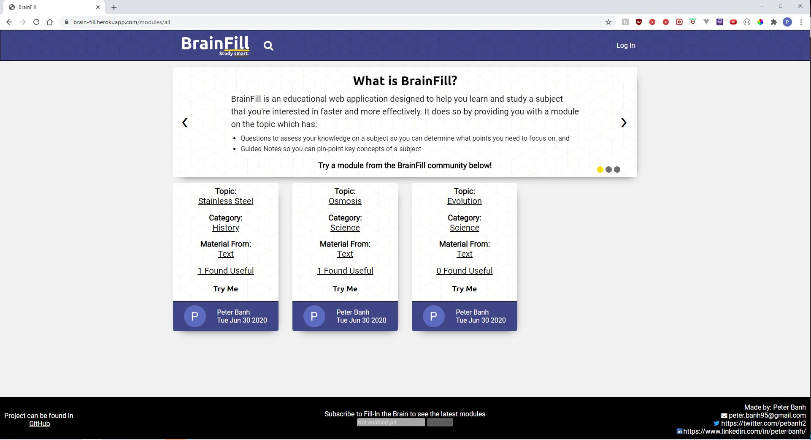
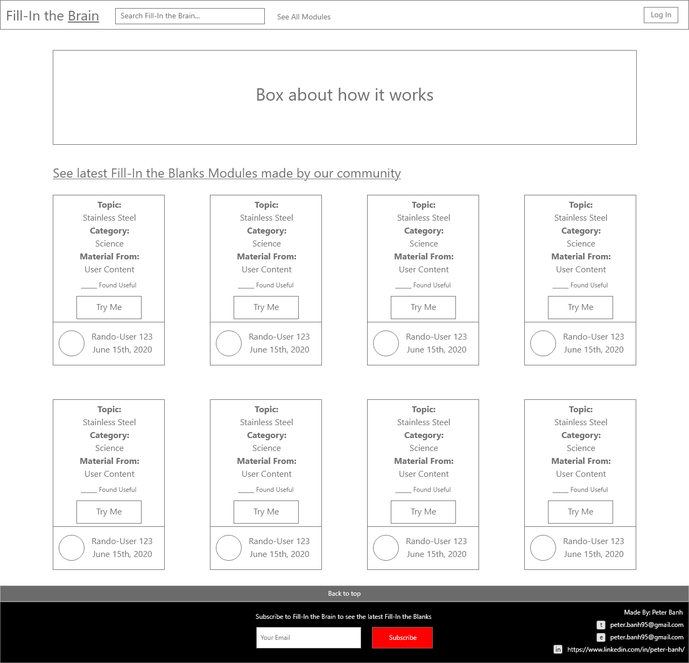
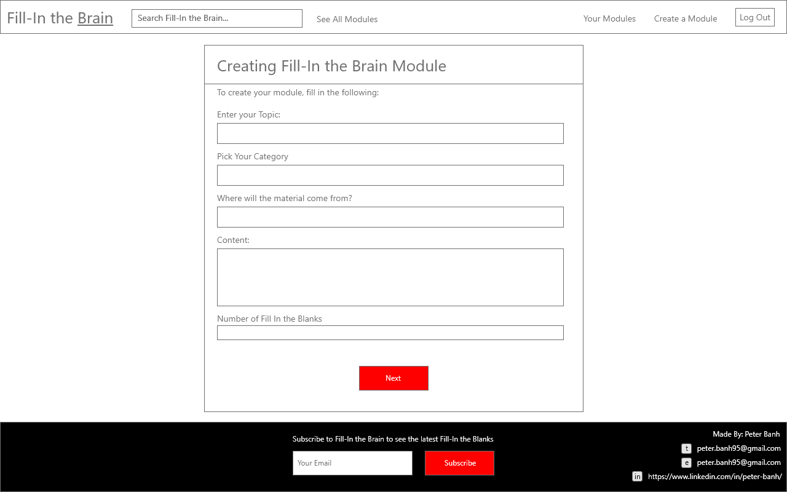
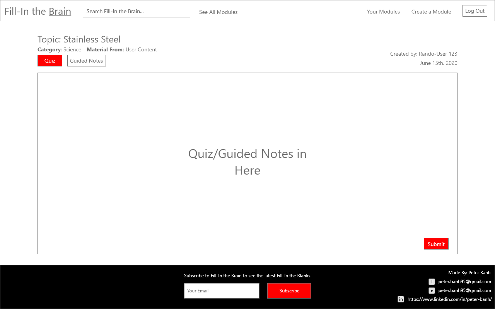
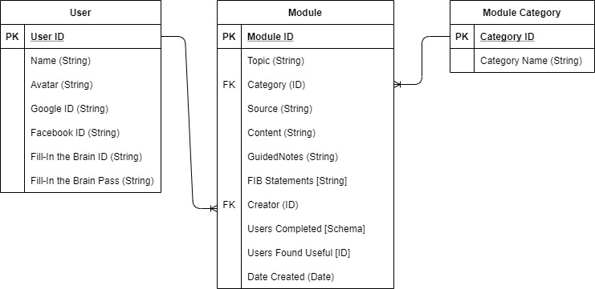

# BrainFill - General Assembly - SEI Project 2


BrainFill is a web application used to create learning modules in the form of fill-in-the-blank statements from content provided by a user. The objective is to provide users with a way to quickly test their knowledge on content they are trying to learn or to provide some guided notes. This application was created for the second project of General Assembly's Software Engineering Immsersive (SEI) Program.

# Technologies Used
BrainFill is a web application based on NodeJS, Express and MongoDB. The database is hosted on MongoDB Atlas and the web application is hosted on Heroku.

# Getting Started
You can find the web app deployed at Heroku [here](https://brain-fill.herokuapp.com/).

# Next Steps
The next steps for the BrainFill application will be to add the additional features included in the Trello Board(link included below) that were not added due to time restrictions or to improve current features. This includes:
- Improving the user's experiene when taking a quiz or doing the guided notes by:
  - Providing an option to show correct answers
  - Improve the style of the user inputs
- Implementing a third-party Natural Language Process (NPL) API to improve how fill-in-the-blank statements are generated. The current algorithm is far too random resulting in some fill-in-the-blank statements not being entirely helpful to a user. The most promising NPL APIs that will be considered are Google Cloud's Natural Language API and IBM's Watson Natural Language Understanding API. One direction is to use the API's feature to determine a word's relevancy/salience to a sentence to determine if it should be used as a blank.
- Modify the regex used in BrainFill such that punctuations are not included in words.
- Introduce different methods of authenticating, this includes using OAuth with Facebook or a built-in authentication system.
- Ensure the application is accessible for mobile users.

# Notes on the Development 
To provide insight of how the application was developed, the following sections are covered:

1. [Project Requirements](#1-project-requirements)
2. [Initial Project Proposal](#2-project-proposal)
3. [User Stories](#3-user-stories)
4. [Wireframes](#4-wireframes)
5. [Entity Relationship Diagram](#5-entity-relationship-diagrams)

## 1. Project Requirements

As part of General Assembly's Software Engineering Immersive Program, students are to create web CRUD application using Node, Express and MongoDB with the following requirements:
  - Have at least 2 data entities, one that represents the main functional idea for the applications and another with a 1-to-many or many-to-many relationship with the main entity.
  - Have Create, Read, Update and Delete operations with the database
  - Be styled in a way that is aligned with the web application's purpose
  - Be able to be deployed online through Heroku

This web application may optionally include the following features:
  - OAuth Authentication
  - Basic Authorization that restricts users from performing CRUD operations unless they are logged in and the data is created by them. ```isLoggedIn``` middlware should be used for this feature.
  - Uses a third-party API
  - Exposes its own API where it returns data resources as JSON

## 2. Project Proposal - Fill-in the Brain
As per the project requirements above, the web application "BrainFill" is proposed. 

This will be an application that will allow users to generate a series of fill in the blank statements based on content they input into the application.

The objective of the application is two-fold, it is to:
1. Provide users with a way to engage with the content they are reading by creating what are called guided notes. The idea is that users are forced to review the material and fill in missing words from statements to have them really reivew the key concepts/facts. This is a method of learning that is generally agreed upon to increase comprehension as described in the following:
    - https://www.interventioncentral.org/academic-interventions/study-organization/guided-notes-increasing-student-engagement-during-lecture-
    - https://www.theteachertoolkit.com/index.php/tool/guided-notes
    - https://udlforteachers.com/fill-in-the-blank-note-taking/

2. Provide users with a simple/fast but more effective way of assessing their knowledge of some material than using just multiple choice questions. This is because fill in the blank questions focus more on a person recalling concepts/facts rather than recognizing answers as described in the following:
    - https://www.forbes.com/sites/rosspomeroy/2014/02/06/multiple-choice-tests-hinder-critical-thinking-should-they-be-used-in-science-classes/#59c224de5ebe
    - https://www.ispringsolutions.com/blog/8-tips-for-writing-good-fill-in-the-blank-questions-in-e-learning-courses

All collections of fill in the blank statements will be called modules and when created, they will be saved on a database for the user to access later on. Users will also be able to use other modules created by another user, however only the user that created the module will be able to delete it.

## 3. User Stories
To truly understand the tasks needed to create the Fill-In the Brain application, a Trello board was created with three categories, Ice Box, Current/MVP(Minimum Viable Product), and Completed, and user stories were brainstormed under the Ice Box Category. 

User stories were ordered in terms of what would be necessary to create a minimum viable project, and the items deemed absolutely neccessary were moved over the Current/MVP category. All other items will be worked on right now only if time permits, otherwise they will be kept for future development.

Below are the results of the initial brainstorming and categorization. Icebox items are ordered in terms of product improvement.
- As a visitor, I want to able to log into the web application because I want to use additional features **(Current/MVP)**.
- As a user, I want to create my own module based on content I submit and save it  **(Current/MVP)**.
- As a user, I want to view all my modules I created because I want to access them whenever  **(Current/MVP)**.
- As a user, I want to be able to take my module and save my results  **(Current/MVP)**.
- As a user, I want to be the only one authorized to delete a module I created **(Current/MVP)**.
- As a user, I want to edit my module **(Current/MVP)**.
- As a visitor, I want to be able to understand the purpose of the web app immediately when I visit **(Icebox)**.
- As a user, I want to switch between using the module as a quiz or using the module as guided notes **(Icebox)**.
- As a visitor, I want to be able to view modules, the content they are based on, and take them anonymously because I want to try out the web application **(Icebox)**.
- As a user, I want to leave comments on modules other people submitted **(Icebox)**.
- As a user, I want to be able to like/dislike modules made by other users **(Icebox)**. 
- As a visitor, I want to search for all other modules created and stored in the database **(Icebox)**.
- As a visitor, I want to search for all other modules created and stored in the database **(Icebox)**.
- As a user, I want to invite friends to complete my module and have their results recorded **(Icebox)**.
- As a visitor, I want to be able to access this website on the mobile **(Icebox)**.
- As a developer, I want to be able to access the database through an API and grab module questions or data on users because I want to use this for my own development **(Icebox)**.

The Trello board can be found [here](https://trello.com/b/0HfglLJ1/fill-in-the-brain). Items in the Current/MVP category will be moved over to completed when finished. Additional items were added since this readme was created.

## 4. Wireframes
To plan the layout of the web application, Adobe XD was used to create a general overview of how each page should look like. Below are a few examples.






## 5. Entity Relationship Diagrams
The BrainFill application uses MongoDB and will follow the ERD shown below.


The reason for the module entity to have all the foreign keys is partially to make the process of removing a module straight forward in the sense that we don't have to scour through the other entities to see which one referenced that particular module document.


